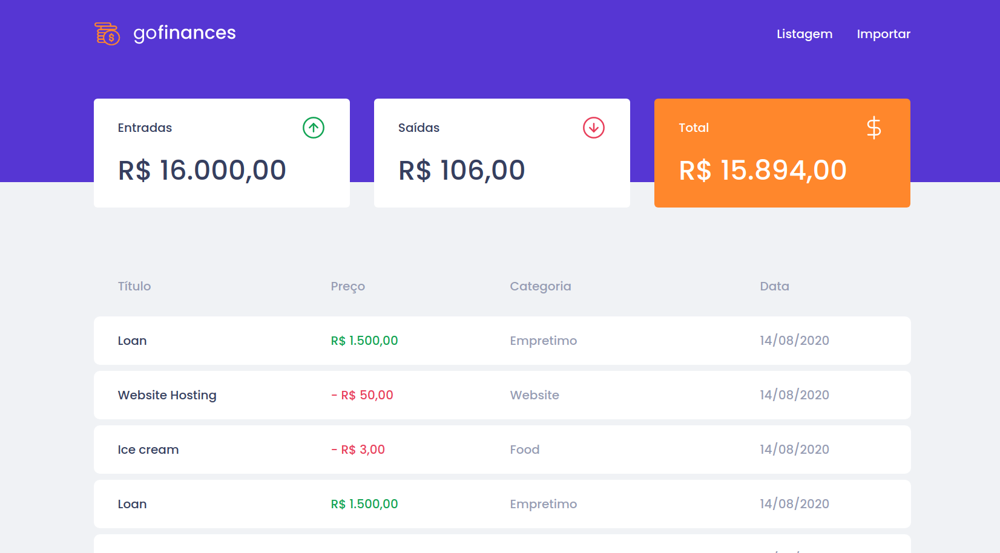

<h2 align="center">
  Desafio 07: GoFinances Web :flying_saucer:
</h2>

  <a href="#rocket-desafio">Desafio</a>&nbsp;&nbsp;&nbsp;|&nbsp;&nbsp;&nbsp;
  <a href="#artificial_satellite-tecnologias">Tecnologias</a>&nbsp;&nbsp;&nbsp;|&nbsp;&nbsp;&nbsp;
  <a href="#gear-funcionalidades">Funcionalidades</a>&nbsp;&nbsp;&nbsp;|&nbsp;&nbsp;&nbsp;
  <a href="#gear-testes-aplicados-nesse-desafio">Testes</a>&nbsp;&nbsp;&nbsp;|&nbsp;&nbsp;&nbsp;
  <a href="#computer-como-contribuir">Como contribuir</a>&nbsp;&nbsp;&nbsp;|&nbsp;&nbsp;&nbsp;
  <a href="#file_folder-licença">Licença</a>

 

## :rocket: Desafio

O objetivo desse desafio foi continuar desenvolvendo a aplicação de gestão de transações, denominado de GoFinances. Praticar o que se aprendeu até agora no React.js junto com Node.js, TypeScript, incluindo o uso de banco de dados com o TypeORM, utilizando rotas e envio de arquivos por formulário.

Essa será uma aplicação que irá se conectar ao seu backend do Desafio 06, e exibir as transações criadas e permitir a importação de um arquivo CSV para gerar novos registros no banco de dados.

<h4 display="flex" align="center">
    
</h4>

## :artificial_satellite: Tecnologias

Esse projeto foi desenvolvido com as seguintes tecnologias:

- [Node.js](https://nodejs.org/en/)
- [React](https://reactjs.org)
- [Express](https://expressjs.com/)
- [Javascript](https://www.javascript.com/)
- [Typescript](https://www.typescriptlang.org/)
- [Outras](#)

## :gear: Funcionalidades

Como funcionalidades da aplicação, temos:

<strong>Listar as transações da sua API:</strong>
Sua página Dashboard deve ser capaz de exibir uma listagem através de uma tabela, com o campo title, value, type e category de todas as transações que estão cadastradas na sua API.

<strong>Exibir o balance da sua API:</strong>
Sua página Dashboard, você deve exibir o balance que é retornado do seu backend, contendo o total geral, junto ao total de entradas e saídas.

<strong>Importar arquivos CSV:</strong>
Na sua página Import, você deve permitir o envio de um arquivo no formato csv para o seu backend, que irá fazer a importação das transações para o seu banco de dados. O arquivo csv deve seguir o seguinte modelo.

## :memo: Testes
 Em cada teste aplicado nesse desafio há uma breve descrição sobre quais quesitos a aplicação deve cumprir para que o teste passe:

<strong> should be able to list the total balance inside the cards: </strong>
Para que esse teste passe, sua aplicação deve permitir que seja exibido na sua Dashboard, cards contendo o total de income, outcome e o total da subtração de income - outcome que são retornados pelo balance do seu backend.

<strong> should be able to list the transactions: </strong>
Para que esse teste passe, sua aplicação deve permitir que sejam listados dentro de uma tabela, toda as transações que são retornadas do seu backend.

<strong> should be able to navigate to the import page: </strong>
Para que esse teste passe, você deve permitir a troca de página através do Header, pelo botão que contém o nome Importar.

<strong> should be able to upload a file: </strong>
Para que esse teste passe, você deve permitir que um arquivo seja enviado através do componente de drag-n-drop na página de import, e que seja possível exibir o nome do arquivo enviado para o input.

## :computer: Como contribuir
- Faça um fork desse repositório;
- Cria uma branch com a sua feature: git checkout -b minha-feature;
- Faça commit das suas alterações: git commit -m 'feat: Minha nova feature';
- Faça push para a sua branch: git push origin minha-feature.
- Depois que o merge da sua pull request for feito, você pode deletar a sua branch.

## :file_folder: Licença
Esse projeto está sob a licença MIT. Veja o arquivo [LICENSE](LICENSE.md) para mais detalhes.

 

#### 
#usemascara :mask: 

